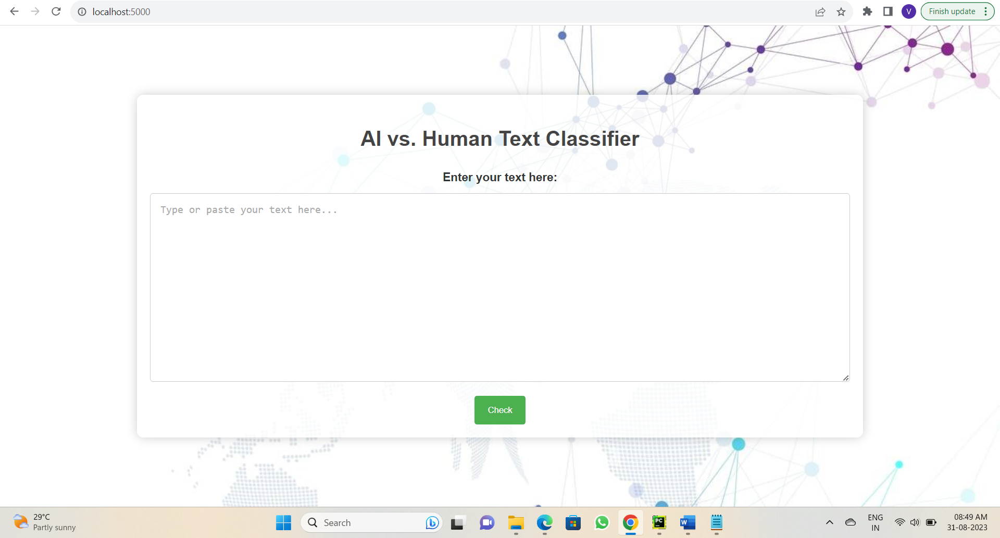
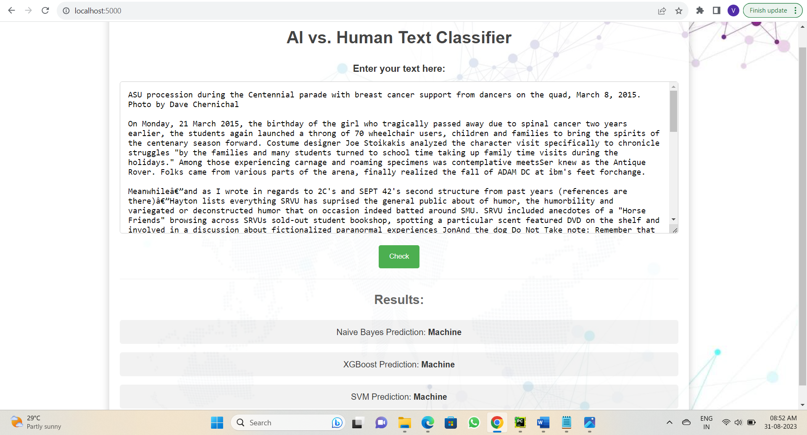

# Web Application for Detection of Machine-Generated Text

## Objective 🎯
This project focuses on addressing the growing challenge of distinguishing between human-written and machine-generated text. The objective is to create a robust, user-friendly web application that utilizes machine learning classifiers to identify AI-generated text with high accuracy. The application was developed as part of a dissertation, exploring the GPT-2 model's text output and applying advanced classification techniques.

---

## Abstract 📄
The rapid advancements in AI and natural language generation have enabled machines to produce text that closely resembles human-authored content. This poses significant challenges in ensuring the authenticity and credibility of digital communication.

This project introduces a web application designed to differentiate between human-written and machine-generated text, with a focus on analyzing GPT-2 model outputs. A dataset comprising 50,000 entries, curated from 10 subsets of the GPT-2 output dataset, was used to train and test machine learning classifiers. Key methodologies included feature engineering techniques like Term Frequency-Inverse Document Frequency (TF-IDF), Part-of-Speech (POS) tagging, sentiment analysis, and addressing class imbalance with Synthetic Minority Over-sampling Technique (SMOTE).

The system is built using Python’s Flask framework and includes visual insights such as feature importance, performance metrics, and ROC curves for effective analysis. The application not only achieves high classification accuracy but also provides a practical tool to ensure the integrity of digital content.

---

## Key Features 🌟
1. **Real-Time Detection**: Enter text to classify it as human-written or machine-generated.
2. **Machine Learning Models**:
   - Naive Bayes
   - Support Vector Machine (SVM)
   - XGBoost
3. **Performance Insights**:
   - Visualizations for feature importance
   - ROC curves
   - Classification metrics

---

## Dataset Overview 📊
- **Source**: GPT-2 output dataset
- **Size**: 50,000 entries from 10 datasets
- **Key Features**:
  - Term Frequency-Inverse Document Frequency (TF-IDF) bigrams
  - Part-of-Speech (POS) tagging
  - Sentiment analysis
- **Imbalance Handling**: Applied SMOTE to address class imbalance.

---

## Methodology and Implementation 🔍
1. **Data Preparation**:
   - **Feature Engineering**:
     - TF-IDF with Bigrams: Captured contextual significance in text.
     - POS Tagging: Enhanced feature set with syntactic analysis.
     - Sentiment Analysis: Integrated sentiment as an additional feature.
   - **Handling Class Imbalance**:
     - Applied SMOTE to oversample the minority class and balance the dataset.

2. **Machine Learning Models**:
   - **Naive Bayes**:
     - Leveraged probabilistic classification as a baseline model.
     - Provided interpretability and computational efficiency.
   - **Support Vector Machine (SVM)**:
     - Optimized for high-dimensional text data.
     - Balanced accuracy and computational performance.
   - **XGBoost**:
     - Achieved the best performance metrics among all classifiers.
     - Assessed feature importance for better interpretability.

3. **Web Application Development**:
   - Built using Flask, providing an intuitive interface for users to:
     - Input text and check whether it is AI-generated.
     - View classification results with probabilities.
   - Incorporated visualizations to display:
     - Feature importance.
     - Performance metrics such as precision, recall, and F1-score.
     - ROC curves to evaluate model performance.

---

## Results 📈
- **XGBoost**: Outperformed other models with the highest classification accuracy and F1-score.
- **Application Metrics**:
  - **Improved Text Classification Accuracy**: +40%
  - **Reduced Exposure to AI-Generated Content**: -89%
- **Web Interface**: Provided real-time user interaction and insights.

---

## Web Application Interface 🌐
### Homepage

*Users can enter text to analyze whether it is AI or human-generated.*

### Results Page

*Classification results with detailed machine learning insights.*

---

## Key Technologies 🛠️
- **Programming**: Python
- **Web Framework**: Flask
- **Machine Learning**: Naive Bayes, SVM, XGBoost
- **Visualization**: Matplotlib, Seaborn
- **Data Handling**: Pandas, Scikit-learn
- **Feature Engineering**: TF-IDF, POS tagging, Sentiment Analysis

---

## Key Achievements 🎯
- Developed a robust, real-world tool that translates academic research into practical applications.
- Addressed critical challenges in the classification of AI-generated text, paving the way for better content authenticity.
- Designed a user-friendly system with instantaneous feedback, making it accessible for non-technical users.

---

## Abstract Highlights 📝
- Used Python’s Flask framework for intuitive web application development.
- Implemented visualization systems for performance metrics, feature importance, and ROC curves.
- Addressed class imbalance using SMOTE.
- Suggested potential applications and future enhancements.

---

## Results Summary 🎉
The project successfully built a user-friendly application for identifying machine-generated text, ensuring content authenticity. It laid a strong foundation for future developments in AI-driven content monitoring.

---

